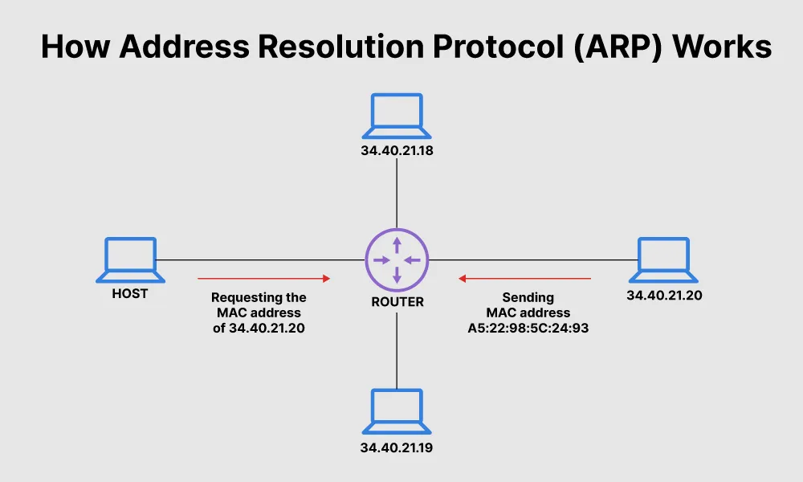

# P4-ARP-Guard

## Overview of the protocol

The Address Resolution Protocol (ARP) is a procedure, which connects IP addresses to fixed physical machine (MAC) addresses in a local area network (LAN).

This mapping is required, because the lengths of the IP and MAC addresses are different, translation is needed, so the systems recognise each other.

An IP address is 32 bits long, MAC address is 48 bits longs, the ARP translates the 32 bit address to 48 and backwards. 
MAC address can also be known as the data link layer, which establishes and terminates the connection between 2 connected devices, and the IP address can also be known as the network layer, which is responsible for forwarding data packets through routers. ARP connects these 2 layers.

### How does ARP work?

When a new device joins the LAN, it'll receive a unique IP address for identification and communication. 
When new packets of data arrive on the gateway, which is responsible for allowing data flow between networks, it asks the ARP to find a MAC address that matches the destination IP address.

The ARP has a cache, which keeps track of IP addresses and matching MAC addresses. The cache is dynamic, but it's possible to configure a static ARP table containing IP and MAC address pairs.

Every time there is a request from a MAC address to send data to another device connected by LAN, the device verifies the cache, if the ARP connection is already completed. If it exists, there is no need for a new request. But if it doesn't exist, then the request for the network address is sentt and ARP translation is completed.

ARP caches are limited, and addresses stay only for a few mintes in the cache, addresses are regularly deleted to free up space.

## Problems with ARP

ARP functions at a low level, without any built-in authentication.

This allows malicious actors, to impersonate legitimate devices, and they can perform man-in-the-middle attacks, like intercepting data traffic, or altering it.

### How does ARP spoofing work?

A cyber criminal can send fake ARP messages to a target LAN, with the intention of linking their MAC address with the IP address of a legitimate device within that LAN network.

ARP spoofing enables other types of attacks, like Man-in-the-middle attacks, DoS attacks, or Session hijacking.

## ARP attack prevention

There are many ways of preventing such attacks.

The solution implemented here will deflect ARP spoofing by moving IP - MAC validation logic into a programmable data plane using P4, which bypasses the restrictions of traditional ARP protocol. 
The solution will follow the following main steps:

<ul>
    <li>Protocol parsing:
        <ul>
            <li>Using the P4 parser, the Ethernet and ARP headers will be extracted</li>
        </ul>
    </li>
    <li>Static ARP validation:
        <ul>
            <li>An exact match table will be defined for the IP - MAC address pairs</li>
            <li>Only valid ARP requests and replies, which match the table pairs will be allowed to process</li>
        </ul>
    </li>
    <li>Attack prevention:
        <ul>
            <li>If a spoofing request fails to match the trusted pairs, the packet will be immediately dropped, before the ARP cache becomes compromised</li>
        </ul>
    </li>
    <li>Attack statistics:
        <ul>
            <li>A hardware level counter will keep track, and will be incremented each time an attack is detected</li>
        </ul>
    </li>
    <li>User alerts:
        <ul>
            <li>Instead of sending the whole packet to the control plane, the switch will package a small metadata structure, containing the attackers MAC address and spoofed IP, and will send asynchronous alerts to the Pythong controller</li>
        </ul>
    </li>
</ul>